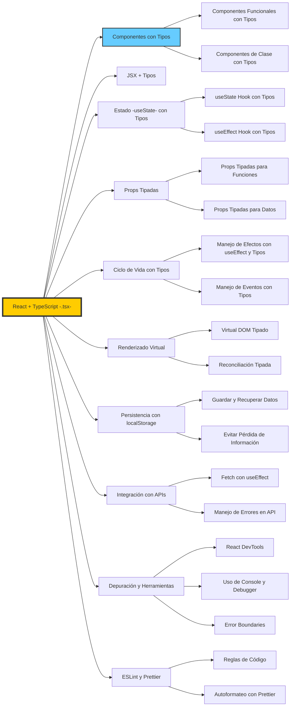
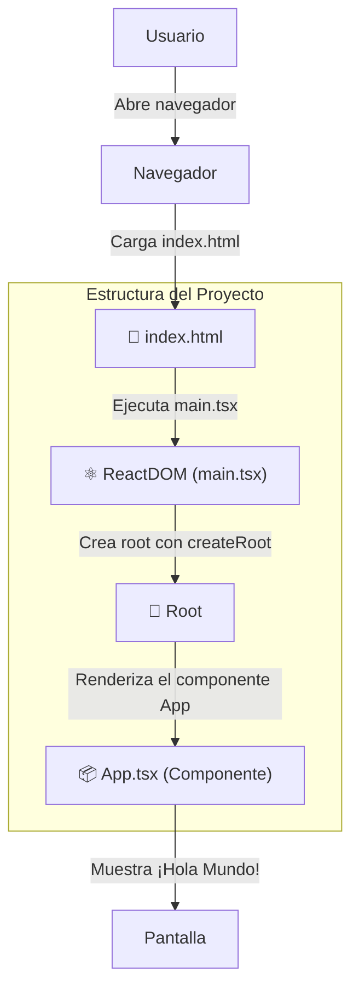
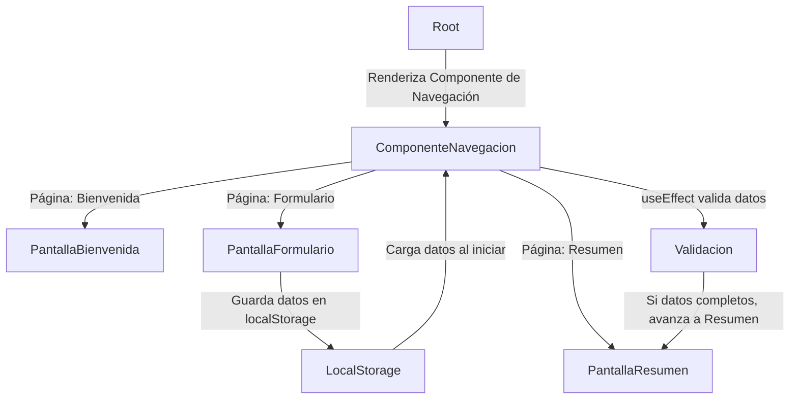

# Instalación

## **Node.js y npm**
React usa **Node.js** y **npm (Node Package Manager)** para manejar paquetes y dependencias.

🔹 **Descargar e instalar:**  
👉 [https://nodejs.org/](https://nodejs.org/) (Recomiendo la versión LTS para mayor estabilidad).

🔹 **Verificar instalación:**  

Abre una terminal y ejecuta:

```sh
node -v
npm -v
```

Si devuelve versiones, la instalación fue correcta.


## **Instalar Visual Studio Code**

🔹 **Descargar e instalar:**  
👉 [https://code.visualstudio.com/](https://code.visualstudio.com/)

🔹 **Extensiones recomendadas para React:**

- **ES7+ React/Redux/React-Native snippets**
- **Prettier - Code formatter** (para formateo automático)
- **React Developer Tools** (para depuración)

Para instalar extensiones, ve a **VS Code → Extensions (Ctrl + Shift + X)** y busca estos nombres.

---
# Mapa REACT vs. Ejercicio




### **🔹 React + TypeScript**
- **React** es una biblioteca para construir interfaces de usuario dinámicas.  
- **TypeScript** agrega tipado estático para mejorar la seguridad y escalabilidad del código.  


### **🟢 Componentes con Tipos**
**Definen la estructura y comportamiento de la UI.**  
**Componentes Funcionales (`B1`)** → Basados en funciones, más ligeros y usan Hooks.  
**Componentes de Clase (`B2`)** → Usan `this.state` y métodos del ciclo de vida (obsoletos en React moderno).  


### **🟠 JSX + Tipos**
**Permite escribir HTML dentro de JavaScript.**  
Compatible con TypeScript para mejorar la seguridad en los datos y eventos.  
Facilita la manipulación del DOM sin necesidad de `document.querySelector()`.  


## Conceptos clave

### **🟡 Estado (`useState`) con Tipos**
**Maneja cambios dinámicos en los componentes.**  
**`useState` (`D1`)** → Define y actualiza valores en tiempo real.  
**`useEffect` (`D2`)** → Ejecuta efectos secundarios al cambiar valores.  


### **🟣 Props Tipadas**
**Permiten pasar datos entre componentes con seguridad.**  
**Props Tipadas para Funciones (`E1`)** → Parámetros en componentes funcionales.  
**Props Tipadas para Datos (`E2`)** → Definición estricta de objetos y listas.  


### **🔵 Ciclo de Vida con `useEffect`**
**Controla cuándo y cómo se actualizan los componentes.**  
**Manejo de Efectos (`F1`)** → Se usa `useEffect` para realizar tareas cuando cambia el estado.  
**Manejo de Eventos (`F2`)** → Eventos tipados en TypeScript (`onClick`, `onChange`).  


### **🟢 Renderizado Virtual**
**React usa el Virtual DOM para mejorar el rendimiento.**  
**Virtual DOM (`G1`)** → React mantiene una copia ligera del DOM para evitar renderizados innecesarios.  
**Reconciliación (`G2`)** → Algoritmo que React usa para actualizar solo los elementos modificados.  


### **🟠 Persistencia con `localStorage`**
**Evita la pérdida de datos tras recargar la página.**  
**Guardar y Recuperar Datos (`H1`)** → Usa `localStorage.setItem()` y `getItem()`.  
**Evitar Pérdida de Información (`H2`)** → Recupera automáticamente datos previos del usuario.  


### **🟡 Integración con APIs**
**Obtiene datos de servidores externos usando `fetch` o `axios`.**  
**Fetch con `useEffect` (`I1`)** → Llamadas a APIs cuando se monta un componente.  
**Manejo de Errores (`I2`)** → `try/catch` para evitar fallos en respuestas de la API.  


### **🟣 Depuración y Herramientas**
**Herramientas para encontrar errores en React.**  
**React DevTools (`J1`)** → Inspecciona el estado y props de los componentes en tiempo real.  
**Console y Debugger (`J2`)** → Uso de `console.log()` y `debugger` para detectar problemas en el código.  
**Error Boundaries (`J3`)** → Componentes que capturan errores en la UI y evitan que la app se bloquee.  


### **🔵 ESLint y Prettier**
**Herramientas para mantener un código limpio y estructurado.**  
**Reglas de Código (`K1`)** → ESLint detecta errores y recomienda mejoras en el código.  
**Autoformateo (`K2`)** → Prettier organiza el código automáticamente según reglas establecidas.  

---

# Crear un Proyecto

<details>
<summary>Crear el proyecto con **Vite** es más rápido y ligero.</summary>
<b>¿Por qué utilizamos Vite para trabajar con React</b> 

Vite es una herramienta de construcción moderna que ofrece varias ventajas sobre otras soluciones como Create React App (CRA). Porque

1. **🚀 Inicio ultrarrápido**  
   - Usa **ES Modules** para cargar solo los archivos necesarios, lo que hace que el desarrollo sea mucho más rápido.
2. **⚡ Hot Module Replacement (HMR) instantáneo**  
   - Los cambios en el código se reflejan casi **al instante**, sin necesidad de recargar toda la aplicación.
3. **📦 Compilación más rápida**  
   - Utiliza **esbuild**, un compilador escrito en Go que es mucho más rápido que Webpack.
4. **🛠️ Configuración simplificada**  
   - Con pocos comandos tienes un entorno listo para React con TypeScript sin configuración extra.
5. **🔌 Soporte para múltiples frameworks**  
   - Vite no solo funciona con React, sino también con Vue, Svelte y otros frameworks modernos.

### **Referencias oficiales 📚**
🔗 **Vite**: [https://vitejs.dev/](https://vitejs.dev/)  
</details>


**Comando para crear un nuevo proyecto con Vite:**

```sh
npm create vite@latest nombre-del-proyecto --template react
````

```
? Select a framework: › - Use arrow-keys. Return to submit.
    Vanilla
    Vue
❯   React
    Preact
    Lit
    Svelte
    Solid
    Qwik
    Angular
    Others

✔ Select a framework: › React
? Select a variant: › - Use arrow-keys. Return to submit.
❯   TypeScript
    TypeScript + SWC
    JavaScript
    JavaScript + SWC
    React Router v7 ↗
```

Reemplaza `nombre-del-proyecto` con el nombre que desees.

**Pasos**

- **Entrar en la carpeta del proyecto:**

```sh
cd nombre-del-proyecto
```

- **Instalar dependencias:**

```sh
npm install
```

- **Ejecutar el Servidor de Desarrollo**

Para ver la aplicación en el navegador, ejecuta:

```sh
npm run dev
```

Luego abre en el navegador la URL que aparece (por defecto `http://localhost:5173/`).

**Estructura del Proyecto**

Después de crear el proyecto, verás una estructura como esta:

📂 nombre-del-proyecto

 ├── 📂 node_modules      # Paquetes instalados

 ├── 📂 public            # Archivos estáticos

 ├── 📂 src               # Código fuente
        ├── App.tsx          # Componente principal

        ├── main.tsx         # Punto de entrada

        ├── index.css        # Estilos globales

 ├── .gitignore           # Archivos ignorados por Git

 ├── package.json         # Configuración del proyecto

 ├── vite.config.js       # Configuración de Vite

**Agregar Estilos**

Puedes editar **`src/index.css`** o crear archivos CSS separados y usarlos en los componentes.

Ejemplo en `App.jsx`:

```jsx
import "./App.css";

export default function App() {
  return <h1 className="titulo">¡Hola, React con Vite!</h1>;
}
```

Y en `App.css`:

```css
.titulo {
  color: blue;
  text-align: center;
}
```

**Agregar Bootstrap o Tailwind (Opcional)**

Si quieres usar estilos predefinidos:

- **Bootstrap:**

```sh
npm install bootstrap
```

Luego impórtalo en `main.jsx`:

```jsx
import "bootstrap/dist/css/bootstrap.min.css";
```

- **Tailwind CSS:**  

```sh
npm install -D tailwindcss postcss autoprefixer
npx tailwindcss init -p
```

Configura `tailwind.config.js` y usa sus clases en los componentes.

---

# Hola Mundo
En este primer ejemplo, trabajaremos con los elementos fundamentales de una aplicación React + TypeScript.

___


### **Elementos Básicos**

- **HTML (`index.html`)**  
  - Será el **punto de entrada** de nuestra aplicación.
  - Contendrá un `<div id="root">` donde React inyectará la app.

- **React con TypeScript (`app.tsx`)**  
  - Crearemos nuestro **primer componente funcional** con TypeScript.
  - Aprenderemos a usar **TSX** (JSX con tipado de TypeScript).
  - Renderizaremos el componente con `ReactDOM.createRoot()`.

- **ReactDOM (`main.tsx`)**  
  - Usaremos `createRoot()` para una renderización **más eficiente**.

  - React 19 optimiza el modelo concurrente para **mejor rendimiento**.

___

## **1. HTML (`index.html`)**
```html
<!DOCTYPE html>
<html lang="es">
<head>
    <meta charset="UTF-8">
    <meta name="viewport" content="width=device-width, initial-scale=1.0">
    <title>React 19 - Hola Mundo</title>
</head>
<body>
    <div id="root"></div>
    <script type="module" src="/src/main.tsx"></script>
</body>
</html>
```

**Explicación:**
- **`<div id="root">`**: Es donde React insertará la aplicación.
- **`<script type="module" src="/src/main.tsx">`**: Carga la aplicación React.

___

## **2. React con TypeScript (`app.tsx`)**
```tsx
// Importamos React para usar JSX
import React from "react";

/**
 * Componente principal de la aplicación
 * @returns JSX.Element
 */
const App: React.FC = () => {
    return <h1>¡Hola Mundo desde React 19 con TypeScript!</h1>;
};

export default App;
```

**Explicación:**
- `React.FC` indica que `App` es un **Componente Funcional**.
- Se usa **Arrow Function (`()=>{}`)** en lugar de `function App() {}` porque:
  - Es **más conciso** .
  - No necesita `this` (mejor para eventos y hooks).
  - Se recomienda en **React con TypeScript**.

___

### **NUEVOS CONCEPTOS**

<details>
<summary>¿Qué es un Componente en React?</summary>

- Un componente es una **función** que devuelve **JSX**.
- Es la **unidad básica** de una aplicación en React.

**Ejemplo:**
```tsx
const Componente: React.FC<{ mensaje: string }> = ({ mensaje }) => {
    return <h1>{mensaje}</h1>;
};
```
</details>

<details>
<summary>Comparación: Función Normal vs. Arrow Function</summary>

```tsx
// Componente con función tradicional
function ComponenteFuncion({ nombre }: { nombre: string }) {
    return <h1>¡Hola, {nombre} desde función tradicional!</h1>;
}

// Componente con Arrow Function (Recomendada)
const ComponenteFlecha: React.FC<{ nombre: string }> = ({ nombre }) => {
    return <h1>¡Hola, {nombre} desde Arrow Function!</h1>;
};
```

**¿Cuál usar?**
`**Arrow Function (`()=>{}`)** es la mejor opción porque:
- Código **más limpio** ✨.
- No usa `this` (mejor en eventos y hooks) 🔥.
- Recomendado en **React 19** ✅.

</details>

___

## **3. ReactDOM en React 19 (`main.tsx`)**

```tsx
import React from "react";
import ReactDOM from "react-dom/client";
import App from "./app";

/**
 * Buscamos el elemento con id "root" en el HTML y lo usamos como contenedor de la aplicación
 */
const rootElement = document.getElementById("root");

if (rootElement) {
    const root = ReactDOM.createRoot(rootElement);
    root.render(
        <React.StrictMode>
            <App />
        </React.StrictMode>
    );
} else {
    console.error("No se encontró el elemento con id 'root'");
}
```

**Explicación:**
- **`ReactDOM.createRoot()`** → Reemplaza `ReactDOM.render()` (React 17).
- **Habilita React Concurrente** 🚀 (mejor rendimiento y re-renderizados eficientes).
- **`StrictMode`** ayuda a detectar errores en desarrollo.

___

>### **NUEVOS CONCEPTOS**
><details>
><summary>¿Qué es `React.StrictMode` y por qué lo usamos?</summary>
>
>1. **`<React.StrictMode>`** es un componente especial que **no se renderiza en el DOM**.
>
>2. **Ayuda a detectar problemas en la aplicación antes de que lleguen a producción**.
>
>3. **Ejecuta funciones dos veces en desarrollo** (`useEffect`, `componentDidMount`).
>***Ejemplo de problema detectado***

```tsx
useEffect(() => {
    console.log("Este efecto se ejecuta dos veces en desarrollo");
}, []);
```

></details>

><details>
><summary>¿Qué es `"react-dom/client"` en React 18+ y React 19?</summary>
>
>- `"react-dom/client"` es el nuevo módulo para renderizar aplicaciones en React 18+.
>
>- Antes, se usaba `"react-dom"` y `ReactDOM.render()`.
>
>- Con `createRoot()`, React maneja mejor el **renderizado concurrente**.
></details>

```tsx
// React 17 (obsoleto)
ReactDOM.render(<App />, document.getElementById("root"));

// React 18+ (recomendado)
const root = ReactDOM.createRoot(document.getElementById("root"));
root.render(<App />);
```

---

# Props, Estado y useEffect

- **Cómo usar `useEffect`** para manejar efectos secundarios en React.
- **Cómo actualizar estados en función de eventos.**
- **Cómo props, estado y efectos trabajan juntos.**
- **Cómo mover la lógica a funciones separadas en eventos `onClick`.**


## **Elementos diferenciales del Proyecto**

- **React con TypeScript (`app.tsx`)**  
  - Creamos un componente `Saludo` que **recibe props** y **usa estado (`useState`)**.
  - Implementamos `useEffect` para **actualizar dinámicamente** el contenido en función del estado.
  - Separamos la lógica del botón en una función externa.

```mermaid
graph TB;
    Root -->|Renderiza el componente Saludo| ComponenteSaludo
    ComponenteSaludo -->|Muestra Hola {nombre}!| Pantalla
    ComponenteSaludo -->|Ejecuta useEffect -actualiza mensaje-| Estado
    Estado -->|Actualiza pantalla| Pantalla
    ComponenteSaludo -->|Botón clickeado| Contador
    Contador -->|useEffect detecta cambio| Estado
```

## **Componente con Props, Estado y `useEffect` (`app.tsx`)**

```tsx
import React, { useState, useEffect } from "react";

/**
 * Componente funcional que usa props, estado y efectos.
 * @param {Object} props - Propiedades del componente.
 * @param {string} props.nombre - Nombre del usuario.
 */
const Saludo: React.FC<{ nombre: string }> = ({ nombre }) => {
    const [contador, setContador] = useState(0);
    const [mensaje, setMensaje] = useState("");

    // useEffect que se ejecuta cuando cambia el contador
    useEffect(() => {
        setMensaje(`Has hecho clic ${contador} veces.`);
    }, [contador]); // Solo se ejecuta cuando cambia "contador"

    // Función externa para manejar el incremento
    const incrementarContador = () => {
        setContador((prev) => prev + 1);
    };

    return (
        <div>
            <h1>¡Hola, {nombre}!</h1>
            <p>{mensaje}</p>
            <button onClick={incrementarContador}>Incrementar</button>
        </div>
    );
};

const App: React.FC = () => {
    return <Saludo nombre="Juan" />;
};

export default App;
```

## **Conceptos Clave**
A continuación, se explican cada uno de los conceptos nuevos con un ejemplo práctico.

### **Props en React**
Las `props` permiten pasar información de un componente padre a un componente hijo.

**Ejemplo:**
```tsx
const Mensaje: React.FC<{ texto: string }> = ({ texto }) => {
    return <p>{texto}</p>;
};

const App: React.FC = () => {
    return <Mensaje texto="¡Hola desde props!" />;
};
```


### **Estado con `useState`**
El hook `useState` nos permite manejar datos dentro de un componente.

**Ejemplo:**
```tsx
const Contador: React.FC = () => {
    const [contador, setContador] = useState(0);

    return (
        <div>
            <p>Contador: {contador}</p>
            <button onClick={() => setContador(contador + 1)}>Sumar</button>
        </div>
    );
};
```

### **Efectos con `useEffect`**
El hook `useEffect` nos permite ejecutar código en ciertos momentos del ciclo de vida del componente.

**Ejemplo:**
```tsx
const MensajeDinamico: React.FC = () => {
    const [mensaje, setMensaje] = useState("Cargando...");

    useEffect(() => {
        setTimeout(() => {
            setMensaje("¡Mensaje actualizado!");
        }, 2000);
    }, []); // Se ejecuta solo una vez

    return <p>{mensaje}</p>;
};
```

### **Funciones en `onClick`**

Podemos manejar eventos con funciones externas para mejorar la organización del código.

**Ejemplo:**

```tsx
const Boton: React.FC = () => {
    const [contador, setContador] = useState(0);

    const incrementar = () => {
        setContador((prev) => prev + 1);
    };

    return (
        <button onClick={incrementar}>Clic {contador} veces</button>
    );
};
```

### **Conclusión**

**`useEffect` para actualizar datos en función del estado.**  
**Props (`nombre`) permiten enviar información al componente.**  
**`useState` almacena datos dinámicos y permite interactividad.**  
**Creamos una interacción con eventos (`onClick`) moviendo la lógica a una función externa.**  

---

# useEffect, props con API

- **Cómo usar `useEffect` para hacer peticiones a una API externa.**
- **Cómo manejar el estado de carga (`loading`) y errores (`error`).**
- **Cómo utilizar props más avanzadas (`id`, `nombre`, `edad`).**
- **Cómo estructurar mejor la lógica en funciones separadas.**

## **Elementos del Proyecto**

- **React con TypeScript (`app.tsx`)**  
  - Creamos un componente `Usuario` que **recibe props** y **muestra datos dinámicos de una API**.
  - Implementamos `useEffect` para **cargar datos desde una API externa** al montar el componente.
  - Agregamos un botón para **refrescar los datos** obtenidos.

```mermaid
graph TB;
    Root -->|Renderiza el componente Usuario| ComponenteUsuario
    ComponenteUsuario -->|Ejecuta useEffect -carga datos API-| Estado
    Estado -->|Actualiza la pantalla con datos| Pantalla
    Usuario -->|Presiona botón \"Refrescar\"| Refrescar
    Refrescar -->|Vuelve a llamar a la API| Estado
```

## **Componente con `useEffect` para Cargar una API (`app.tsx`)**
```tsx
import React, { useState, useEffect } from "react";

/**
 * Tipo de datos para el usuario.
 */
type UsuarioProps = {
    id: number;
    nombre: string;
    edad: number;
};

/**
 * Componente que muestra información de un usuario y permite refrescar los datos.
 */
const Usuario: React.FC = () => {
    const [usuario, setUsuario] = useState<UsuarioProps | null>(null);
    const [loading, setLoading] = useState<boolean>(true);
    const [error, setError] = useState<string | null>(null);

    // Función para obtener datos de usuario desde una API simulada
    const fetchUsuario = async () => {
        setLoading(true);
        setError(null);

        try {
            const response = await fetch("https://jsonplaceholder.typicode.com/users/1");
            if (!response.ok) throw new Error("Error al cargar los datos");

            const data = await response.json();
            // Simulamos un usuario con datos de la API
            const nuevoUsuario: UsuarioProps = {
                id: data.id,
                nombre: data.name,
                edad: Math.floor(Math.random() * (50 - 18 + 1) + 18), // Edad aleatoria entre 18 y 50
            };
            setUsuario(nuevoUsuario);
        } catch (err) {
            setError("No se pudo obtener la información del usuario.");
        } finally {
            setLoading(false);
        }
    };

    // useEffect para cargar el usuario al montar el componente
    useEffect(() => {
        fetchUsuario();
    }, []);

    return (
        <div>
            <h1>Información del Usuario</h1>
            {loading && <p>Cargando...</p>}
            {error && <p style={{ color: "red" }}>{error}</p>}
            {usuario && (
                <>
                    <p>ID: {usuario.id}</p>
                    <p>Nombre: {usuario.nombre}</p>
                    <p>Edad: {usuario.edad}</p>
                </>
            )}
            <button onClick={fetchUsuario}>Refrescar Usuario</button>
        </div>
    );
};

const App: React.FC = () => {
    return <Usuario />;
};

export default App;
```

## **Conceptos Clave**
A continuación, se explican cada uno de los conceptos nuevos con un ejemplo práctico.

### **Props Avanzadas en React**
Las `props` pueden ser más detalladas con tipos específicos.

**Ejemplo:**

```tsx
type UsuarioProps = {
    id: number;
    nombre: string;
    edad: number;
};

const TarjetaUsuario: React.FC<UsuarioProps> = ({ id, nombre, edad }) => {
    return (
        <div>
            <h3>{nombre}</h3>
            <p>ID: {id} | Edad: {edad}</p>
        </div>
    );
};

const App: React.FC = () => {
    return <TarjetaUsuario id={1} nombre="Carlos" edad={30} />;
};
```

### **`useState` con Datos Dinámicos**

Manejo de estado para almacenar objetos.

**Ejemplo:**

```tsx
const [usuario, setUsuario] = useState<{ nombre: string; edad: number }>({
    nombre: "Ana",
    edad: 25,
});

// Cambiar el estado con un nuevo usuario
setUsuario({ nombre: "Juan", edad: 32 });
```

### **`useEffect` para Llamar a una API**

Ejecutar código al montar un componente.

**Ejemplo:**

```tsx
useEffect(() => {
    fetch("https://jsonplaceholder.typicode.com/users/1")
        .then((res) => res.json())
        .then((data) => console.log(data));
}, []);
```

Se ejecuta **una vez** al montar el componente.

### **Botón para Refrescar Datos (`onClick`)**

Podemos ejecutar una nueva llamada a la API con un botón.

**Ejemplo:**

```tsx
<button onClick={() => fetchUsuario()}>Refrescar Datos</button>
```

**Cada clic carga nuevos datos desde la API.**

### **Conclusión**

**`useEffect` nos permite cargar datos desde una API.**  
**Manejamos el estado con `useState` (`loading`, `error`, `usuario`).**  
**Creamos `props` avanzadas con objetos tipados (`UsuarioProps`).**  
**Evitamos errores en la API con `try/catch` y control de estado.**  
**Creamos un botón para refrescar los datos dinámicamente.**  

---

# Navegación, Persistencia y Validaciones Automáticas

- **Cómo manejar navegación entre páginas usando `useState`.**
- **Cómo persistir datos en `localStorage` para que no se pierdan al recargar.**
- **Cómo usar `useEffect` para validar automáticamente los datos antes de avanzar.**

## **Elementos del Proyecto**

- **React con TypeScript (`app.tsx`)**  
  - Creamos un sistema de navegación entre "Bienvenida", "Formulario" y "Resumen".
  - Guardamos datos en `localStorage` y los recuperamos si existen.
  - Validamos automáticamente los datos con `useEffect`.



## **Componente con `useState`, `localStorage` y `useEffect` (`app.tsx`)**

```tsx
import React, { useState, useEffect } from "react";

/**
 * Tipos de datos para el formulario.
 */
type FormularioDatos = {
    nombre: string;
    edad: string;
};

/**
 * Componente que maneja la navegación entre páginas y la persistencia de datos.
 */
const App: React.FC = () => {
    const [pagina, setPagina] = useState<string>("bienvenida");
    const [datos, setDatos] = useState<FormularioDatos>(() => {
        const datosGuardados = localStorage.getItem("formularioDatos");
        return datosGuardados ? JSON.parse(datosGuardados) : { nombre: "", edad: "" };
    });

    // Guardar datos en localStorage cada vez que cambian
    useEffect(() => {
        localStorage.setItem("formularioDatos", JSON.stringify(datos));
    }, [datos]);

    // Validar automáticamente y avanzar si los datos están completos
    useEffect(() => {
        if (datos.nombre && datos.edad && pagina === "formulario") {
            setPagina("resumen");
        }
    }, [datos, pagina]);

    return (
        <div>
            {pagina === "bienvenida" && (
                <>
                    <h1>Bienvenido</h1>
                    <button onClick={() => setPagina("formulario")}>Ir al Formulario</button>
                </>
            )}

            {pagina === "formulario" && (
                <>
                    <h1>Formulario</h1>
                    <input
                        type="text"
                        placeholder="Nombre"
                        value={datos.nombre}
                        onChange={(e) => setDatos({ ...datos, nombre: e.target.value })}
                    />
                    <input
                        type="number"
                        placeholder="Edad"
                        value={datos.edad}
                        onChange={(e) => setDatos({ ...datos, edad: e.target.value })}
                    />
                </>
            )}

            {pagina === "resumen" && (
                <>
                    <h1>Resumen</h1>
                    <p>Nombre: {datos.nombre}</p>
                    <p>Edad: {datos.edad}</p>
                </>
            )}
        </div>
    );
};

export default App;
```

## **Conceptos Claves**

A continuación, se explican cada uno de los conceptos nuevos con un ejemplo práctico.

### **Navegación con `useState`**

Podemos cambiar entre diferentes "páginas" de una aplicación controlando un estado.

**Ejemplo:**

```tsx
const [pagina, setPagina] = useState("inicio");

return (
    <div>
        {pagina === "inicio" && <h1>Inicio</h1>}
        {pagina === "formulario" && <h1>Formulario</h1>}
        <button onClick={() => setPagina("formulario")}>Ir al Formulario</button>
    </div>
);
```

### **Persistencia de Datos con `localStorage`**

Guardamos datos en `localStorage` para que no se pierdan al recargar la página.

**Ejemplo:**

```tsx
useEffect(() => {
    localStorage.setItem("nombreUsuario", nombre);
}, [nombre]); // Guarda "nombre" cada vez que cambia
```

**Recuperar datos al cargar:**

```tsx
const [nombre, setNombre] = useState(() => {
    return localStorage.getItem("nombreUsuario") || "";
});
```

### **`useEffect` para Validaciones Automáticas**

Podemos verificar datos y tomar decisiones sin que el usuario haga clic en un botón.

**Ejemplo:**

```tsx
useEffect(() => {
    if (nombre.length > 3) {
        console.log("Nombre válido");
    }
}, [nombre]); // Se ejecuta cada vez que cambia "nombre"
```

## **Conclusión**

**Usamos `useState` para manejar navegación entre páginas.**  
**Persistimos datos con `localStorage`, evitando pérdidas al recargar.**  
**Validamos automáticamente con `useEffect`, mejorando la experiencia de usuario.**  
**Creamos una navegación fluida sin necesidad de un router.**  

---


# Depuración en React

Depurar una aplicación React es clave para detectar errores y mejorar el rendimiento. En este apartado, exploraremos herramientas y técnicas esenciales para **debuggear una aplicación React** de manera eficiente.

## **React Developer Tools (React DevTools)**

**Extensión para Chrome y Firefox** que permite inspeccionar componentes React, revisar su estado y props en tiempo real.

**Instalación:**  
🔗 Descarga desde [Chrome Web Store](https://chrome.google.com/webstore/detail/react-developer-tools)  

**Uso:**
1. Abre las **herramientas de desarrollo** (`F12` o `Ctrl + Shift + I` en Chrome).
2. Ve a la pestaña **"Components"** para inspeccionar los componentes React.
3. Ve a la pestaña **"Profiler"** para analizar el rendimiento.

**Ejemplo de inspección de estado en DevTools**  

```tsx

const [contador, setContador] = useState(0);

```

Puedes modificar el valor del `contador` directamente en DevTools para ver cambios en la UI.

## **Consola de JavaScript (`console.log`)**

El método más simple y efectivo para depurar valores y flujos en React.

**Ejemplo:**

```tsx
const handleClick = () => {
    console.log("Botón clickeado");
    setContador(contador + 1);
};
```

**Útil para:**

- Ver valores de variables en diferentes momentos.  
- Detectar si un evento o función se ejecuta correctamente.  

**Ejemplo para depurar `useEffect`:**

```tsx
useEffect(() => {
    console.log("El efecto se ejecutó con estado:", estado);
}, [estado]);
```

## **Depuración con `debugger` en JavaScript**

El comando `debugger` permite pausar la ejecución del código y analizar variables en la consola del navegador.

**Ejemplo:**

```tsx
const handleClick = () => {
    debugger; // La ejecución se detendrá aquí
    setContador(contador + 1);
};
```

**Paso a paso en DevTools:**  
1. Abre la consola (`F12` en Chrome).  
2. Ejecuta el código y cuando `debugger` se ejecute, la ejecución se detendrá.  
3. Inspecciona variables y estado en el panel "Sources".

## **React StrictMode y Advertencias en Consola**

React `StrictMode` ayuda a detectar problemas potenciales mostrando advertencias en la consola.

**Ejemplo en `main.tsx`:**

```tsx
<React.StrictMode>
    <App />
</React.StrictMode>
```

**Detecta:**

- Renderizados innecesarios.  
- Métodos obsoletos.  
- Errores en efectos secundarios (`useEffect`).  

## **Manejo de Errores con `try/catch` y `Error Boundaries`**

Si una API falla o hay un error inesperado en un componente, podemos capturarlo y evitar que toda la app se rompa.

**Ejemplo: Capturar errores en un `fetch`**

```tsx
useEffect(() => {
    const fetchData = async () => {
        try {
            const response = await fetch("https://api.example.com/data");
            if (!response.ok) throw new Error("Error en la API");
            const data = await response.json();
            console.log(data);
        } catch (error) {
            console.error("Fallo en la carga de datos:", error);
        }
    };

    fetchData();
}, []);
```

**Ejemplo: Error Boundary en React**

```tsx
class ErrorBoundary extends React.Component {
    state = { hasError: false };

    static getDerivedStateFromError() {
        return { hasError: true };
    }

    render() {
        if (this.state.hasError) {
            return <h2>¡Algo salió mal!</h2>;
        }
        return this.props.children;
    }
}

// Uso:
<ErrorBoundary>
    <App />
</ErrorBoundary>
```

**Evita que un error rompa toda la aplicación.**

---

# ESLint en React

ESLint es una herramienta que nos ayuda a **detectar errores** y **mantener un código limpio** en aplicaciones JavaScript y TypeScript. En este apartado, aprenderemos:

- **Qué es ESLint y por qué es importante.**
- **Cómo instalar y configurar ESLint en un proyecto React.**
- **Cómo usar ESLint para mejorar la calidad del código.**

## **¿Qué es ESLint y por qué usarlo?**

**ESLint** es un **linter** para JavaScript y TypeScript que analiza el código en busca de:
**Errores de sintaxis y problemas comunes.**  
**Malas prácticas o código obsoleto.**  
**Inconsistencias en el formato del código (indentación, espacios, comillas).**  

**Ejemplo de código sin ESLint (mala práctica)**:

```tsx
function Saludar(props){
return <h1>Hola {props.nombre}</h1>}
```

**Problemas detectados por ESLint:**
❌ Falta de espacios adecuados.  
❌ `props` no está tipado correctamente.  
❌ Falta de indentación adecuada.

**Código corregido con ESLint**:

```tsx
const Saludar: React.FC<{ nombre: string }> = ({ nombre }) => {
    return <h1>Hola {nombre}</h1>;
};
```
Código más limpio y legible.  
Mejores prácticas garantizadas.

## **Instalación de ESLint en un Proyecto React con TypeScript**
Si tienes un proyecto con **Vite o Create React App**, puedes instalar ESLint fácilmente:

**Paso 1: Instalar ESLint en el proyecto**
```bash
npm install eslint --save-dev
```

**Paso 2: Inicializar ESLint**

```bash
npx eslint --init
```

🔹 Responde a las preguntas de configuración:  

- **¿Cómo quieres usar ESLint?** → "Para verificar errores de sintaxis y encontrar problemas".  
- **¿Qué tipo de módulo usas?** → "ESModules".  
- **¿Qué framework usas?** → "React".  
- **¿Qué formato de configuración prefieres?** → "JSON" o "JavaScript".  

## **Configuración Básica de `.eslintrc.js`**

Después de inicializar ESLint, el archivo de configuración `.eslintrc.js` se verá así:

```js
module.exports = {
    env: {
        browser: true,
        es2021: true
    },
    extends: [
        "eslint:recommended",
        "plugin:react/recommended",
        "plugin:@typescript-eslint/recommended"
    ],
    parser: "@typescript-eslint/parser",
    parserOptions: {
        ecmaFeatures: {
            jsx: true
        },
        ecmaVersion: "latest",
        sourceType: "module"
    },
    plugins: ["react", "@typescript-eslint"],
    rules: {
        "react/prop-types": "off",
        "indent": ["error", 4],
        "quotes": ["error", "double"],
        "semi": ["error", "always"]
    }
};
```

**Explicación de las reglas:**  
`"eslint:recommended"` → Activa las reglas recomendadas de ESLint.  
`"plugin:react/recommended"` → Activa reglas específicas para React.  
`"plugin:@typescript-eslint/recommended"` → Reglas para TypeScript.  
`"quotes": ["error", "double"]` → Obliga a usar comillas dobles.  
`"semi": ["error", "always"]` → Requiere punto y coma al final de las líneas.  

## **Ejecutar ESLint en el Proyecto**
Para analizar el código, ejecuta:

```bash
npx eslint src --fix
```

**Esto revisará el código y corregirá automáticamente errores menores**.

**Ejemplo de error corregido por ESLint**:

```tsx
// Código con error
const suma = (a, b) => a+b

// Código corregido automáticamente
const suma = (a, b) => a + b;
```

## **Integración con Prettier (Opcional)**

Si quieres que ESLint **corrija errores de formato automáticamente**, combina ESLint con Prettier.

**Instalar Prettier y su plugin para ESLint**

```bash
npm install --save-dev prettier eslint-config-prettier eslint-plugin-prettier
```

**Actualizar `.eslintrc.js` para incluir Prettier**

```js
extends: [
    "eslint:recommended",
    "plugin:react/recommended",
    "plugin:@typescript-eslint/recommended",
    "plugin:prettier/recommended"
]
```

**Ejecutar ESLint con Prettier**

```bash
npx eslint src --fix
```

Ahora ESLint corregirá código y aplicará formato automáticamente.

## **ESLint en VSCode**

Para usar ESLint en **Visual Studio Code**:
- Instala la extensión **ESLint** desde el Marketplace.  
- Agrega `"editor.codeActionsOnSave": { "source.fixAll.eslint": true }` en **settings.json** para corregir automáticamente al guardar.  

**Corrección automática en cada guardado:**

```json
"editor.codeActionsOnSave": {
    "source.fixAll.eslint": true
}
```

## **Conclusión**

**ESLint ayuda a detectar errores y mejorar el código.**  
**Podemos configurarlo para seguir reglas específicas.**  
**Funciona con React y TypeScript sin problemas.**  
**Se puede integrar con Prettier para formato automático.**  

---


# Formulario alternativo.

```survey:2```

---

# Fin